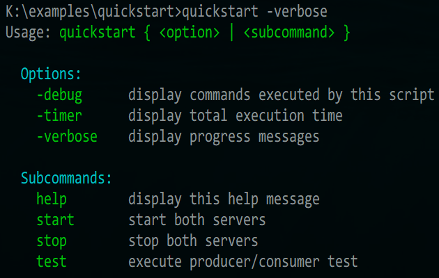
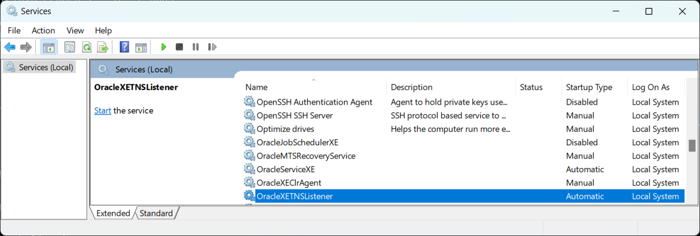

# Kafka examples <a href="../README.md">⬆</a>

<table style="font-family:Helvetica,Arial;line-height:1.6;">
  <tr>
  <td style="border:0;padding:0 10px 0 0;min-width:120px;">
    
  </td>
  <td style="border:0;padding:0;vertical-align:text-top;">
    Directory <strong><code>examples\</code></strong> contains <a href="https://kafka.apache.org/" rel="external">Kafka</a> code examples coming from various websites - mostly from the <a href="https://kafka.apache.org/" rel="external">Kafka project</a>.
  </td>
  </tr>
</table>

## `quickstart` Example

This first example presents the mininal scenario found in the official [Kafka] documentation and in many introductory articles.

In this scenario most of the work focuses on the configuration of the [Kafka] commands; our example is set up as follows :
- directory [`config\`](./config/) contains properties files (e.g. `zookeeper.properties` for the Zookeeper service). We slightly modified those files (e.g. Windows paths) after copying them from the [Kafka] installation directory (i.e. `%KAFKA_HOME%\config\*.properties`).
- command [`quickstart.bat`](./quickstart/quickstart.bat) features several subcommands such as `start`, `stop` and `test` to facilitate the user experience in a Windows environment.

  

In resume, the two subcommands `start` and `stop` manage the Zookeeper and Kafka services and subcommand `test` creates a topic and starts both a producer (*which gets its input from a text file*) and a consumer (press `Ctrl-C` to stop it).

Command [**`quickstart.bat`**](./quickstart/quickstart.bat)` start` launches the two services after performing several checks (e.g. don't start service if already up and running) :

<pre style="font-size:80%;">
<b>&gt; <a href="./quickstart/quickstart.bat">quickstart</a> start -verbose</b>
Check if Zookeeper service is already up and running
Start the Zookeeper service
Check if Kafka service is already up and running
Check if local port 8080 is free (needed for Jetty AdminServer)
Start the Kafka server process
</pre>

The [Zookeeper] server [1](#footnote_01) is started in a separate window (using the Windows command [`start`][windows_start]) :

<pre style="font-size:80%;">
[...]
[2023-01-25 19:03:39,788] INFO Reading configuration from: K:\examples\config\zookeeper.properties
[2023-01-25 19:03:39,804] INFO clientPortAddress is <b>0.0.0.0:2181</b>
[...]
[2023-01-25 19:03:39,835] INFO
[2023-01-25 19:03:39,835] INFO   ______
[2023-01-25 19:03:39,835] INFO  |___  /                 | |
[2023-01-25 19:03:39,835] INFO     / /    ___     ___   | | __   ___    ___   _ __     ___   _ __ 
[2023-01-25 19:03:39,835] INFO    / /    / _ \   / _ \  | |/ /  / _ \  / _ \ | '_ \   / _ \ | '__|
[2023-01-25 19:03:39,835] INFO   / /__  | (_) | | (_) | |   <  |  __/ |  __/ | |_) | |  __/ | |
[2023-01-25 19:03:39,835] INFO  /_____|  \___/   \___/  |_|\_\  \___|  \___| | .__/   \___| |_|
[2023-01-25 19:03:39,835] INFO                                               | |
[2023-01-25 19:03:39,835] INFO                                               |_|
[2023-01-25 19:03:39,835] INFO
[2023-01-25 19:03:39,866] INFO Server environment:<b>zookeeper.version=3.8.3</b>--6401e4ad2087061bc6b9f80dec2d69f2e3c8660a, built on 04/08/2021 16:35 GMT
[2023-01-25 19:03:39,866] INFO Server environment:host.name=192.168.0.105
[2023-01-25 19:03:39,866] INFO Server environment:<b>java.version=17.0.9</b>
[...]
</pre>

And the [Kafka] server [2](#footnote_02) starts in another window (using the Windows command [`start`][windows_start]) :

<pre style="font-size:80%;">
[...]
[2023-01-25 19:03:45,286] INFO starting
[2023-01-25 19:03:45,287] INFO Connecting to zookeeper on localhost:2181
[2023-01-25 19:03:45,303] INFO [ZooKeeperClient Kafka server] Initializing a new session to localhost:2181.
[2023-01-25 19:03:45,326] INFO Client environment:zookeeper.version=3.8.3--6401e4ad2087061bc6b9f80dec2d69f2e3c8660a, built on 04/08/2021 16:35 GMT
[2023-01-25 19:03:45,328] INFO Client environment:<b>host.name=192.168.0.105</b>
[2023-01-25 19:03:45,329] INFO Client environment:<b>java.version=17.0.9</b>
[...]
[2023-01-25 19:03:45,460] INFO [ZooKeeperClient Kafka server] Connected.
[...]
[2023-01-25 19:03:45,797] INFO KafkaConfig values:
        [...]
        zookeeper.clientCnxnSocket = null
        zookeeper.connect = localhost:2181
        zookeeper.connection.timeout.ms = 18000
        zookeeper.max.in.flight.requests = 10
        zookeeper.session.timeout.ms = 18000
        zookeeper.set.acl = false
       [...]
 (kafka.server.KafkaConfig)
[...]
[2023-01-25 19:03:47,022] INFO Kafka version: <b>3.6.1</b>
[2023-01-25 19:03:47,023] INFO Kafka commitId: b66af662e61082cb
[2023-01-25 19:03:47,023] INFO Kafka startTimeMs: 1674669827014
[2023-01-25 19:03:47,028] INFO [KafkaServer id=0] started
</pre>

Command [`quickstart`](./quickstart/quickstart.bat)` test` launches the producer in a separate windows before starting the consumer :

<pre style="font-size:80%;">
<b>&gt; <a href="./quickstart/quickstart.bat">quickstart</a> -verbose test</b>
Check if Kafka service is already up and running
Create topic "quickstart-events"
Describe topic "quickstart-events"
Topic: quickstart-events        TopicId: LFRfTV5GSASW5UCjUBdNNA PartitionCount: 1       ReplicationFactor: 1    Configs:
        Topic: quickstart-events        Partition: 0    Leader: 0       Replicas: 0     Isr: 0
List available topics
quickstart-events
Produce some messages to topic "quickstart-events"
Consume the messages from topic "quickstart-events"
Hello world
Apache Kafka
&lt;Ctrl-C&gt;
Processed a total of 2 messages
</pre>

The producer is started in a separate windows (using the Windows command [`start`][windows_start]) and reads its input from a text file; this frees the user from typing text in the console (and pressing `Ctrl-C` to stop it).

## Footnotes [**&#x25B4;**](#top)

[1] ***Zookeeper startup logging*** [↩](#anchor_01)

<dl><dd>
Here is a more detailed extract of the Zookeeper startup <code>INFO</code> logging :
<pre style="font-size:80%;">
[...]
[2023-01-25 19:03:39,788] INFO Reading configuration from: K:\examples\config\zookeeper.properties (o.a.z.s.quorum.QuorumPeerConfig)
[2023-01-25 19:03:39,804] INFO clientPortAddress is 0.0.0.0:2181 (o.a.z.s.quorum.QuorumPeerConfig)
[2023-01-25 19:03:39,804] INFO secureClientPort is not set (o.a.z.s.quorum.QuorumPeerConfig)
[2023-01-25 19:03:39,804] INFO observerMasterPort is not set (o.a.z.s.quorum.QuorumPeerConfig)
[2023-01-25 19:03:39,804] INFO metricsProvider.className is org.apache.zookeeper.metrics.impl.DefaultMetricsProvider (o.a.z.s.quorum.QuorumPeerConfig)
[2023-01-25 19:03:39,804] INFO autopurge.snapRetainCount set to 3 (o.a.z.s.DatadirCleanupManager)
[2023-01-25 19:03:39,804] INFO autopurge.purgeInterval set to 0 (o.a.z.s.DatadirCleanupManager)
[2023-01-25 19:03:39,804] INFO Purge task is not scheduled. (o.a.z.s.DatadirCleanupManager)
[2023-01-25 19:03:39,804] WARN Either no config or no quorum defined in config, running in standalone mode (o.a.z.s.quorum.QuorumPeerMain)
[2023-01-25 19:03:39,804] INFO Log4j 1.2 jmx support not found; jmx disabled. (org.apache.zookeeper.jmx.ManagedUtil)
[2023-01-25 19:03:39,804] INFO Reading configuration from: C:\opt\kafka_2.13-3.6.1\config\zookeeper.properties (o.a.z.s.quorum.QuorumPeerConfig)
[2023-01-25 19:03:39,804] INFO clientPortAddress is 0.0.0.0:2181 (o.a.z.s.quorum.QuorumPeerConfig)
[2023-01-25 19:03:39,804] INFO secureClientPort is not set (o.a.z.s.quorum.QuorumPeerConfig)
[2023-01-25 19:03:39,804] INFO observerMasterPort is not set (o.a.z.s.quorum.QuorumPeerConfig)
[2023-01-25 19:03:39,804] INFO metricsProvider.className is org.apache.zookeeper.metrics.impl.DefaultMetricsProvider (o.a.z.s.quorum.QuorumPeerConfig)
[2023-01-25 19:03:39,804] INFO Starting server (o.a.z.s.ZooKeeperServerMain)
[2023-01-25 19:03:39,819] INFO ServerMetrics initialized with provider org.apache.zookeeper.metrics.impl.DefaultMetricsProvider@60704c (o.a.z.s.ServerMetrics)
[2023-01-25 19:03:39,819] INFO zookeeper.snapshot.trust.empty : false (o.a.z.s.persistence.FileTxnSnapLog)
[2023-01-25 19:03:39,835] INFO  (o.a.z.s.ZooKeeperServer)
[2023-01-25 19:03:39,835] INFO   ______                  _                                          (o.a.z.s.ZooKeeperServer)
[2023-01-25 19:03:39,835] INFO  |___  /                 | |                                         (o.a.z.s.ZooKeeperServer)
[2023-01-25 19:03:39,835] INFO     / /    ___     ___   | | __   ___    ___   _ __     ___   _ __   (o.a.z.s.ZooKeeperServer)
[2023-01-25 19:03:39,835] INFO    / /    / _ \   / _ \  | |/ /  / _ \  / _ \ | '_ \   / _ \ | '__|  (o.a.z.s.ZooKeeperServer)
[2023-01-25 19:03:39,835] INFO   / /__  | (_) | | (_) | |   <  |  __/ |  __/ | |_) | |  __/ | |     (o.a.z.s.ZooKeeperServer)
[2023-01-25 19:03:39,835] INFO  /_____|  \___/   \___/  |_|\_\  \___|  \___| | .__/   \___| |_|     (o.a.z.s.ZooKeeperServer)
[2023-01-25 19:03:39,835] INFO                                               | |                    (o.a.z.s.ZooKeeperServer)
[2023-01-25 19:03:39,835] INFO                                               |_|                    (o.a.z.s.ZooKeeperServer)
[2023-01-25 19:03:39,835] INFO  (o.a.z.s.ZooKeeperServer)
[2023-01-25 19:03:39,866] INFO Server environment:zookeeper.version=3.8.3--6401e4ad2087061bc6b9f80dec2d69f2e3c8660a, built on 04/08/2021 16:35 GMT (o.a.z.s.ZooKeeperServer)
[2023-01-25 19:03:39,866] INFO Server environment:host.name=192.168.0.105 (o.a.z.s.ZooKeeperServer)
[2023-01-25 19:03:39,866] INFO Server environment:java.version=17.0.9 (o.a.z.s.ZooKeeperServer)
[2023-01-25 19:03:39,866] INFO Server environment:java.vendor=Eclipse Adoptium (o.a.z.s.ZooKeeperServer)
[2023-01-25 19:03:39,866] INFO Server environment:java.home=C:\opt\jdk-temurin-17.0.9_9 (o.a.z.s.ZooKeeperServer)
[2023-01-25 19:03:39,866] INFO Server environment:java.class.path=C:\opt\kafka_2.13-3.6.1\libs\activation-1.1.1.jar;[...];C:\opt\kafka_2.13-3.6.1\libs\zstd-jni-1.5.2-1.jar (o.a.z.s.ZooKeeperServer)
[2023-01-25 19:03:39,882] INFO Server environment:java.library.path=C:\opt\jdk-temurin-17.0.9_9\bin;[...];. (o.a.z.s.ZooKeeperServer)
[2023-01-25 19:03:39,898] INFO Server environment:java.io.tmpdir=%LOCALAPPDATA%\Temp\ (o.a.z.s.ZooKeeperServer)
[...]
[2023-01-25 19:03:39,904] INFO Server environment:os.memory.free=495MB (o.a.z.s.ZooKeeperServer)
[2023-01-25 19:03:39,904] INFO Server environment:os.memory.max=512MB (o.a.z.s.ZooKeeperServer)
[2023-01-25 19:03:39,904] INFO Server environment:os.memory.total=512MB (o.a.z.s.ZooKeeperServer)
[2023-01-25 19:03:39,904] INFO zookeeper.enableEagerACLCheck = false (o.a.z.s.ZooKeeperServer)
[2023-01-25 19:03:39,904] INFO zookeeper.digest.enabled = true (o.a.z.s.ZooKeeperServer)
[2023-01-25 19:03:39,904] INFO zookeeper.closeSessionTxn.enabled = true (o.a.z.s.ZooKeeperServer)
[2023-01-25 19:03:39,904] INFO zookeeper.flushDelay=0 (o.a.z.s.ZooKeeperServer)
[2023-01-25 19:03:39,904] INFO zookeeper.maxWriteQueuePollTime=0 (o.a.z.s.ZooKeeperServer)
[2023-01-25 19:03:39,904] INFO zookeeper.maxBatchSize=1000 (o.a.z.s.ZooKeeperServer)
[2023-01-25 19:03:39,904] INFO zookeeper.intBufferStartingSizeBytes = 1024 (o.a.z.s.ZooKeeperServer)
[...]
[2023-01-25 19:03:40,127] INFO ZooKeeper audit is disabled. (org.apache.zookeeper.audit.ZKAuditProvider)
[2023-01-25 19:03:45,436] INFO Creating new log file: log.1 (o.a.z.s.persistence.FileTxnLog)
</pre>
</dd></dl>

[2] ***Kafka startup logging*** [↩](#anchor_02)

<dl><dd>
Here is a more detailed extract of the Kafka startup <code>INFO</code> logging :
<pre style="font-size:80%;">
[2023-01-25 19:03:44,909] INFO Registered kafka:type=kafka.Log4jController MBean (kafka.utils.Log4jControllerRegistration$)
[2023-01-25 19:03:45,175] INFO Setting -D jdk.tls.rejectClientInitiatedRenegotiation=true to disable client-initiated TLS renegotiation (org.apache.zookeeper.common.X509Util)
[2023-01-25 19:03:45,286] INFO starting (kafka.server.KafkaServer)
[2023-01-25 19:03:45,287] INFO Connecting to zookeeper on localhost:2181 (kafka.server.KafkaServer)
[2023-01-25 19:03:45,303] INFO [ZooKeeperClient Kafka server] Initializing a new session to localhost:2181. (kafka.zookeeper.ZooKeeperClient)
[2023-01-25 19:03:45,326] INFO Client environment:zookeeper.version=3.8.3--6401e4ad2087061bc6b9f80dec2d69f2e3c8660a, built on 04/08/2021 16:35 GMT (org.apache.zookeeper.ZooKeeper)
[2023-01-25 19:03:45,328] INFO Client environment:host.name=192.168.0.105 (org.apache.zookeeper.ZooKeeper)
[2023-01-25 19:03:45,329] INFO Client environment:java.version=17.0.9 (org.apache.zookeeper.ZooKeeper)
[2023-01-25 19:03:45,330] INFO Client environment:java.vendor=Eclipse Adoptium (org.apache.zookeeper.ZooKeeper)
[2023-01-25 19:03:45,331] INFO Client environment:java.home=C:\opt\jdk-temurin-17.0.9_9 (org.apache.zookeeper.ZooKeeper)
[2023-01-25 19:03:45,332] INFO Client environment:java.class.path=C:\opt\kafka_2.13-3.6.1\libs\activation-1.1.1.jar;[...];. (org.apache.zookeeper.ZooKeeper)
[2023-01-25 19:03:45,353] INFO Client environment:java.io.tmpdir=C:\Users\michelou\AppData\Local\Temp\ (org.apache.zookeeper.ZooKeeper)
[2023-01-25 19:03:45,353] INFO Client environment:java.compiler=<NA> (org.apache.zookeeper.ZooKeeper)
[2023-01-25 19:03:45,354] INFO Client environment:os.name=Windows 11 (org.apache.zookeeper.ZooKeeper)
[2023-01-25 19:03:45,354] INFO Client environment:os.arch=amd64 (org.apache.zookeeper.ZooKeeper)
[2023-01-25 19:03:45,354] INFO Client environment:os.version=10.0 (org.apache.zookeeper.ZooKeeper)
[2023-01-25 19:03:45,355] INFO Client environment:user.name=michelou (org.apache.zookeeper.ZooKeeper)
[2023-01-25 19:03:45,356] INFO Client environment:user.home=C:\Users\michelou (org.apache.zookeeper.ZooKeeper)
[2023-01-25 19:03:45,356] INFO Client environment:user.dir=K:\examples\quickstart (org.apache.zookeeper.ZooKeeper)
[2023-01-25 19:03:45,357] INFO Client environment:os.memory.free=988MB (org.apache.zookeeper.ZooKeeper)
[2023-01-25 19:03:45,357] INFO Client environment:os.memory.max=1024MB (org.apache.zookeeper.ZooKeeper)
[2023-01-25 19:03:45,357] INFO Client environment:os.memory.total=1024MB (org.apache.zookeeper.ZooKeeper)
[2023-01-25 19:03:45,360] INFO Initiating client connection, connectString=localhost:2181 sessionTimeout=18000 watcher=kafka.zookeeper.ZooKeeperClient$ZooKeeperClientWatcher$@1f81aa00 (org.apache.zookeeper.ZooKeeper)
[2023-01-25 19:03:45,411] INFO jute.maxbuffer value is 4194304 Bytes (org.apache.zookeeper.ClientCnxnSocket)
[2023-01-25 19:03:45,416] INFO zookeeper.request.timeout value is 0. feature enabled=false (org.apache.zookeeper.ClientCnxn)
[2023-01-25 19:03:45,419] INFO [ZooKeeperClient Kafka server] Waiting until connected. (kafka.zookeeper.ZooKeeperClient)
[2023-01-25 19:03:45,421] INFO Opening socket connection to server localhost/[0:0:0:0:0:0:0:1]:2181. (org.apache.zookeeper.ClientCnxn)
[2023-01-25 19:03:45,425] INFO Socket connection established, initiating session, client: /[0:0:0:0:0:0:0:1]:14577, server: localhost/[0:0:0:0:0:0:0:1]:2181 (org.apache.zookeeper.ClientCnxn)
[2023-01-25 19:03:45,456] INFO Session establishment complete on server localhost/[0:0:0:0:0:0:0:1]:2181, session id = 0x1004782d10b0000, negotiated timeout = 18000 (org.apache.zookeeper.ClientCnxn)
[2023-01-25 19:03:45,460] INFO [ZooKeeperClient Kafka server] Connected. (kafka.zookeeper.ZooKeeperClient)
[...]
[2023-01-25 19:03:45,797] INFO KafkaConfig values:
        advertised.listeners = null
        alter.config.policy.class.name = null
        alter.log.dirs.replication.quota.window.num = 11
        alter.log.dirs.replication.quota.window.size.seconds = 1
        authorizer.class.name =
        auto.create.topics.enable = true
        auto.leader.rebalance.enable = true
        background.threads = 10
        broker.heartbeat.interval.ms = 2000
        broker.id = 0
        broker.id.generation.enable = true
        broker.rack = null
        broker.session.timeout.ms = 9000
        client.quota.callback.class = null
        compression.type = producer
        connection.failed.authentication.delay.ms = 100
        connections.max.idle.ms = 600000
        connections.max.reauth.ms = 0
        [...]
        zookeeper.clientCnxnSocket = null
        zookeeper.connect = localhost:2181
        zookeeper.connection.timeout.ms = 18000
        zookeeper.max.in.flight.requests = 10
        zookeeper.session.timeout.ms = 18000
        zookeeper.set.acl = false
        zookeeper.ssl.cipher.suites = null
        zookeeper.ssl.client.enable = false
        zookeeper.ssl.crl.enable = false
        zookeeper.ssl.enabled.protocols = null
        zookeeper.ssl.endpoint.identification.algorithm = HTTPS
        zookeeper.ssl.keystore.location = null
        zookeeper.ssl.keystore.password = null
        zookeeper.ssl.keystore.type = null
        zookeeper.ssl.ocsp.enable = false
        zookeeper.ssl.protocol = TLSv1.2
        zookeeper.ssl.truststore.location = null
        zookeeper.ssl.truststore.password = null
        zookeeper.ssl.truststore.type = null
 (kafka.server.KafkaConfig)
[...]
[2023-01-25 19:03:47,022] INFO Kafka version: 3.6.1 (org.apache.kafka.common.utils.AppInfoParser)
[2023-01-25 19:03:47,023] INFO Kafka commitId: b66af662e61082cb (org.apache.kafka.common.utils.AppInfoParser)
[2023-01-25 19:03:47,023] INFO Kafka startTimeMs: 1674669827014 (org.apache.kafka.common.utils.AppInfoParser)
[2023-01-25 19:03:47,028] INFO [KafkaServer id=0] started (kafka.server.KafkaServer)
</pre>
</dd></dl>

[3] ***Java Processes*** [↩](#anchor_03)

<dl><dd>
We rely on the <a href="https://docs.oracle.com/javase/8/docs/technotes/tools/windows/jps.html"><code><b>jps.exe</b></code></a> command to check if the Kafka and <a href="https://zookeeper.apache.org/" rel="external">Zookeeper</a> services are running locally on our machine :
</dd>
<dd>
<pre style="font-size:80%;">
<b>&gt; echo %JAVA_HOME%</b>
C:\opt\jdk-temurin-17.0.9_9
&nbsp;
<b>&gt; %JAVA_HOME%\bin\<a href="https://docs.oracle.com/javase/8/docs/technotes/tools/windows/jps.html">jps</a> -l</b>
12452 kafka.Kafka
15912 org.apache.zookeeper.server.quorum.QuorumPeerMain
6584 jdk.jcmd/sun.tools.jps.Jps
&nbsp;
<b>&gt; %JAVA_HOME%\bin\<a href="https://docs.oracle.com/javase/8/docs/technotes/tools/windows/jps.html">jps</a> -lm | <a href="https://docs.microsoft.com/en-us/windows-server/administration/windows-commands/findstr">findstr</a> "kafka.Kafka zookeeper.server"</b>
12452 kafka.Kafka K:\examples\config\server.properties
15912 org.apache.zookeeper.server.quorum.QuorumPeerMain K:\examples\config\zookeeper.properties
</pre>
</dd></dl>

[4] ***Port already bound*** [↩](#anchor_04)

<dl><dd>
Here is how one can find which running process is listening on the local port <b>8080</b> :
<pre style="font-size:80%;">
<b>&gt; <a href="https://learn.microsoft.com/en-us/windows-server/administration/windows-commands/netstat" rel="external">netstat</a> -aon | <a href="https://learn.microsoft.com/en-us/windows-server/administration/windows-commands/findstr" rel="external">findstr</a> 8080</b>
  TCP    0.0.0.0:8080           0.0.0.0:0              LISTENING       3208
  TCP    [::]:8080              [::]:0                 LISTENING       3208
&nbsp;
<b>&gt; <a href="https://learn.microsoft.com/en-us/windows-server/administration/windows-commands/tasklist" rel="external">tasklist</a> | <a href="https://learn.microsoft.com/en-us/windows-server/administration/windows-commands/findstr" rel="external">findstr</a> 3208</b>
java.exe                      3208 Console                    1     98,552 K
</pre>

<pre style="font-size:80%;">
<b>&gt; <a href="./quickstart/quickstart.bat">quickstart</a> -verbose start</b>
Check if Zookeeper service is already up and running
Start the Zookeeper service
Check if Kafka service is already up and running
Check if local port 8080 is free (needed for Jetty AdminServer)
Process 6000 already uses port 8080
TNSLSNR.EXE                   6000 Services                   0     15,456 K
</pre>
</dd>
<dd>
For instance, the StackOverflow post <a href="https://stackoverflow.com/questions/56747959/zookepper-unable-to-start-adminserver-exiting-abnormally">"ZooKepper Unable to start AdminServer, exiting abnormally"</a> gives a concrete case of the issue.
</dd></dl>

***

*[mics](https://lampwww.epfl.ch/~michelou/)/April 2024* [**&#9650;**](#top)
&nbsp;

[jpd_cmd]: https://docs.oracle.com/javase/8/docs/technotes/tools/windows/jps.html
[kafka]: https://kafka.apache.org
[windows_start]: https://learn.microsoft.com/en-us/windows-server/administration/windows-commands/start
[zookeeper]: https://zookeeper.apache.org/

